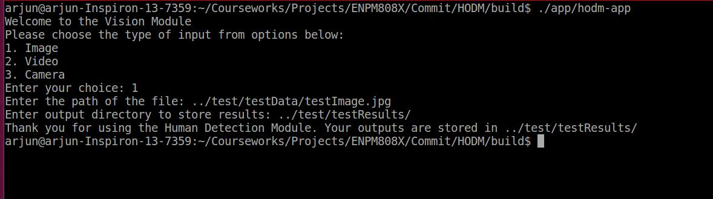
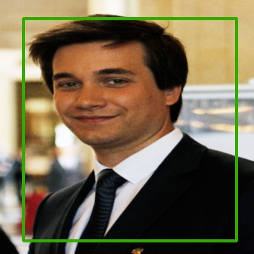

# Human Obstacle Detection Module
[](https://travis-ci.org/rohansingh42/HODM)
[](https://coveralls.io/github/rohansingh42/HODM?branch=master)
[](https://opensource.org/licenses/MIT)
---

## Overview

This repository contains the implementation of the Human Obstacle Detection module. The human obstacle detector module can take the image, video, camera feed as input and output the localization of the detected humans in the robot’s reference frame. The output of the module contains the top left corner, the bottom right corner and the frame ID of the object (that contains the human). The module uses a pretrained network of YOLOv3 to make the predictions. The model is pretrained on COCO dataset, for making it more robust for detection. This module can be further integrated with a task-specific control module (such as path planning module) which utilizes the detection information.

The gif below shows the output of the network. It is on one of the test runs on the surveillence video (in _test/testResults/DemoVideos.zip_) and the predictions clearly indicate that such modules with more fine tuning can be perfectly deployed for tasks such as human tracking, counting humans, etc. 


In this project we have strictly emphasized on the preprocessing and the post processing of the data. During our several test runs we found that removing noise significantly improves the accuracy of the output thus makes our system more reliable.

We also transform the coordinates of the bounding from the image coordinate system to the robots perspective frame assuming that the camera and the eyes of the robot coincide. 


# Important Note

In the text file we store just the frame id, object ID, top left and bottom right corners of the detected bounding box and exclude the center and confidence score (as mentioned in the proposal). The reason for this change is that the threshold values for the detections are kept pretty high so that robot detect only the sureshot objects thus storing confidence score is not useful information. Second the enter is excluded because th network sometimes predict the bounding boxes that exceed the boundaries of the image frame and we cut the bounding box at the boundary of the image thus making center inconsistent with the corners. 

# Workflow Overview

The following steps discuss the overall workflow of the pipeline in the mentioned order:

  1. The user is asked to chose the input from three input options.

  2. After the user choice is obtained, the user is asked for the path of the input file. The module verifies whether the input filepath is valid or not.

  3. Upon validation the user is asked for the output directory path.

  4. Once the input file and output path are obtained. The module reads the file based on its type. If the input is image then it simply reads it, otherwise the network breaks the video into frames and parse those frames as images for processing.

  5. Once the image is obtained, the image is resized to the shape of (416, 416) without cropping.

  6. The resized image is then processed for noise removal. We have used the gaussian filter to remove the noise but have also implemented mean and median filters for user's choice.

  7. This preprocessed image is then converted to blob which is the desired input for the network.

  8. The network is given the blob as input and the detections are generated.

  9. We use two level thresholding two reduce the number of bounding boxes. One is confidence score thresholding and second is non maximal suppressing. 

  10. First the bounding boxes with low confidence scores are eliminated and then the bounding boxes with overlap of more than the threshold are merged to reduce the significant number of boxes

  11. The top left and the bottom right corners of the of the box along with frame id are stored in a vector. The obtained coordinates are then transformed from the image coordinate system to the robot's perspective frame.

  12. The detection results with respective image/video and the text file are stored in the output directory path.

## Personnel 

Rohan Singh: I am in my third semester of M.Eng. in Robotics at University of Maryland. You can follow me on my [Linkedin](www.linkedin.com/in/rohansingh42)
Arjun Gupta: I am in my third semester of M.Eng. in Robotics at University of Maryland. My research interest lies in the field of computer vision. You can follow me on my [Linkedin](https://www.linkedin.com/in/arjung27/)

## Product Backlog 
[](https://docs.google.com/spreadsheets/d/1Du2DV9m7JFUn_xO6RULXBDN6mna-3IR8e5ZURudZHeg/edit?usp=sharing)
[](https://docs.google.com/document/d/1uqs_taycl7V5bicxRjuwfQ20OX_oftU3iqrRO5jNhTU/edit?usp=sharing)

The Agile Iterative Process was followed for the development of the software. Follow this Google Sheets [link](https://docs.google.com/spreadsheets/d/1Du2DV9m7JFUn_xO6RULXBDN6mna-3IR8e5ZURudZHeg/edit?usp=sharing) to view the product backlog and sprint schedules. Follow this Google Docs [link](https://docs.google.com/document/d/1uqs_taycl7V5bicxRjuwfQ20OX_oftU3iqrRO5jNhTU/edit?usp=sharing) to view Sprint Planning sheet.

## Dependencies
To build this module, the following dependecies should be met:

- CMake version at least 3.5.1
- OpenCV 4.0 or higher: Installation instructions can be found [here](https://www.learnopencv.com/install-opencv-4-on-ubuntu-16-04/)
- Google Test: Unit test requires gtest framework by Google

## Build package

```
git clone --recursive https://github.com/rohansingh42/HODM.git
cd <path to repository>
mkdir build
cd build
cmake ..
make
```

## Run demo
After building the package,
```
cd <path to repository>
cd build
./app/hodm-app
```
For a demo of the module functionality on an image, provide the input as indicated in the following figure.



The demo will run and show result image with detection boxes, and save a text file with the name "DetectionsFile.txt" in the _test/testResults/_ subdirectory. You may also provide your own images(just follow instructions shown on terminal and enter absolute pathe whenever asked).

The output image will look like 



For a demo with live detections from your laptop camera, choose option 3 when initially asked. Then enter a device ID(>0) and choose an output directory. Press the "Esc" to exit.

## Running tests
```
cd <path to repository>
./build/test/cpp-test
```

## Building for code coverage 
```
sudo apt-get install lcov
cmake -D COVERAGE=ON -D CMAKE_BUILD_TYPE=Debug ../
make
make code_coverage
```
This generates a index.html page in the build/coverage sub-directory that can be viewed locally in a web browser.

## Doxygen
To install Doxygen, 
```
sudo apt install doxygen
```
To generate the Doxygen documentation 
```
doxygen ./Doxygen
```

## License

```
MIT License

Copyright (c) 2019 Rohan Singh, Arjun Gupta

Permission is hereby granted, free of charge, to any person obtaining a copy
of this software and associated documentation files (the "Software"), to deal
in the Software without restriction, including without limitation the rights
to use, copy, modify, merge, publish, distribute, sublicense, and/or sell
copies of the Software, and to permit persons to whom the Software is
furnished to do so, subject to the following conditions:

The above copyright notice and this permission notice shall be included in all
copies or substantial portions of the Software.

THE SOFTWARE IS PROVIDED "AS IS", WITHOUT WARRANTY OF ANY KIND, EXPRESS OR
IMPLIED, INCLUDING BUT NOT LIMITED TO THE WARRANTIES OF MERCHANTABILITY,
FITNESS FOR A PARTICULAR PURPOSE AND NONINFRINGEMENT. IN NO EVENT SHALL THE
AUTHORS OR COPYRIGHT HOLDERS BE LIABLE FOR ANY CLAIM, DAMAGES OR OTHER
LIABILITY, WHETHER IN AN ACTION OF CONTRACT, TORT OR OTHERWISE, ARISING FROM,
OUT OF OR IN CONNECTION WITH THE SOFTWARE OR THE USE OR OTHER DEALINGS IN THE
SOFTWARE.
```
